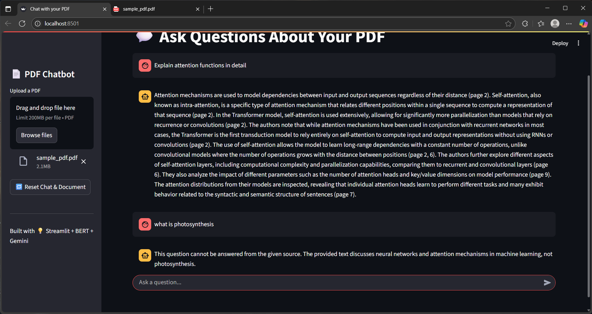

# 🤖 Chat with Your PDF – RAG From Scratch

This project is a **RAG (Retrieval-Augmented Generation)** pipeline that lets users upload a PDF and chat with it using natural language questions. It combines:

- ✅ BERT embeddings for semantic search
- ✅ FAISS for fast similarity retrieval
- ✅ Gemini (Google Generative AI) for answer generation
- ✅ Streamlit UI that looks and feels like ChatGPT

For more details regarding model, do refer rag.ipynb file

---

## 🧱 Class Overview (in `main.py`)

### `DocLoader`
- Loads and cleans text from each page of a PDF using PyMuPDF (`fitz`).
- Handles paragraph separation and sentence chunking.
- Method:
  - `.preprocess()`: Cleans unwanted newline artifacts.
  - `.split()`: Splits text into sentence-based chunks (~150 words each).

### `Embedder`
- Uses `bert-base-uncased` to convert text chunks into embeddings.
- Handles tokenization and mean pooling of token-level embeddings.
- Method:
  - `.tokenize()`
  - `.mean_embedding()`

### `Retriever`
- Builds a FAISS index on BERT embeddings.
- Performs similarity search to retrieve top-k relevant chunks.
- Method:
  - `.build_index()`
  - `.retrieve(query, k=7)`

### `AnswerGenerator`
- Uses Gemini API (via `google.generativeai`) to generate answers using context.
- Cites source page numbers in a readable format.
- Method:
  - `.generate(query, chunks, page_nums)`

---

## 🚀 Running the App
  1. **Install dependencies**

        pip install -r requirements.txt
  2. **Add your API key to .env**
  3. **Start the app**

        streamlit run chatbot.py

