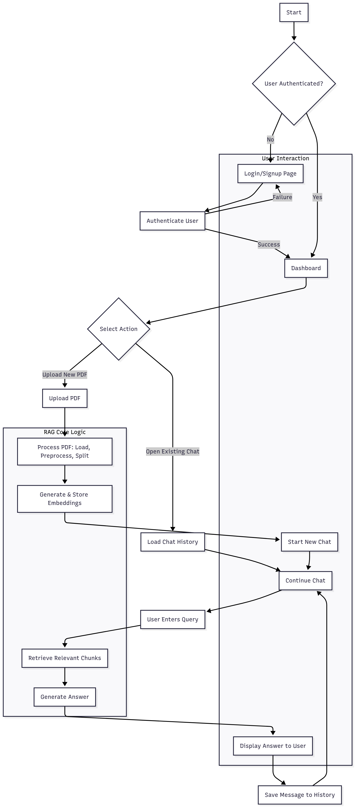
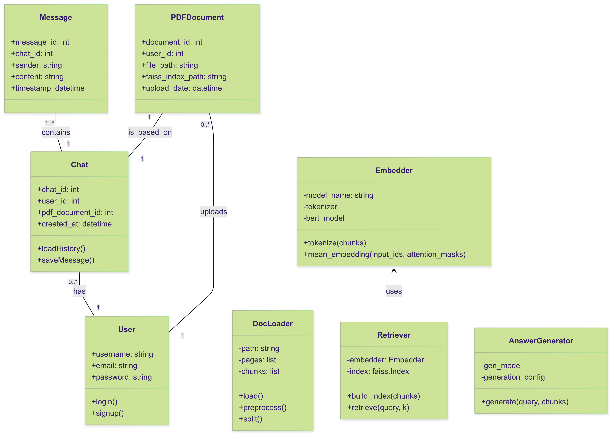
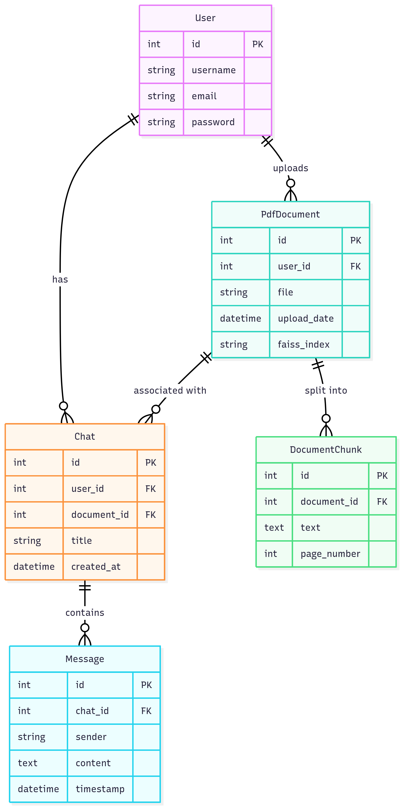
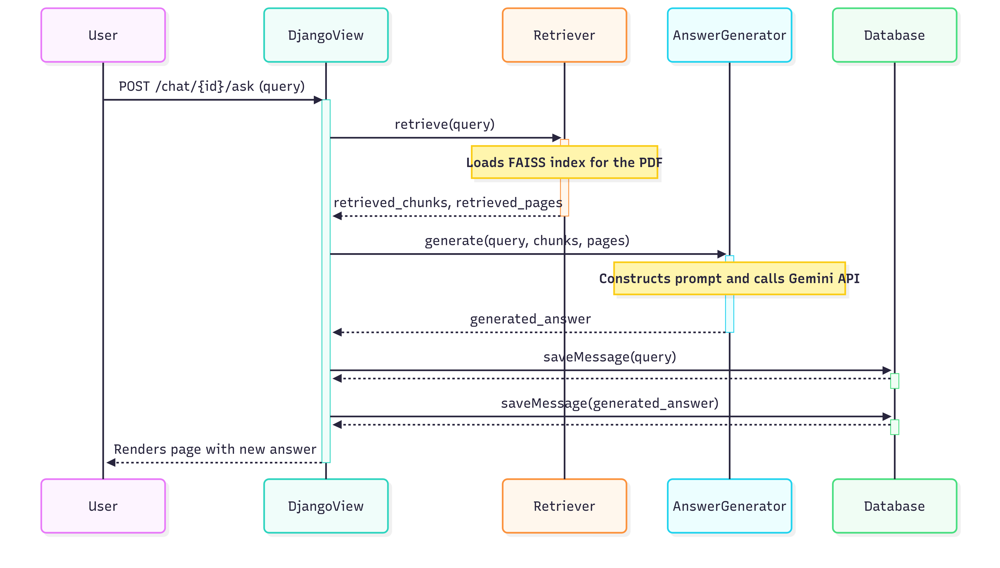

# 🤖 Chat with Your PDF – RAG From Scratch


This project is a **RAG (Retrieval-Augmented Generation)** pipeline that lets users upload a PDF and chat with it using natural language questions. It combines:

- ✅ BERT embeddings for semantic search
- ✅ FAISS for fast similarity retrieval
- ✅ Gemini (Google Generative AI) for answer generation
- ✅ Django backend + MySQL for authentication and persistent chat history
- ✅ An alternate Streamlit UI (just run rag/chatbot.py)

For more details regarding model, do refer  

---

## 🧱 Class Overview (in `rag/main.py`)

### `DocLoader`
- Loads and cleans text from each page of a PDF using PyMuPDF (`fitz`).
- Handles paragraph separation and sentence chunking.
- Method:
  - `.preprocess()`: Cleans unwanted newline artifacts.
  - `.split()`: Splits text into sentence-based chunks (~150 words each).

### `Embedder`
- Uses `bert-base-uncased` to convert text chunks into embeddings.
- Handles tokenization and mean pooling of token-level embeddings.
- Method:
  - `.tokenize()`
  - `.mean_embedding()`

### `Retriever`
- Builds a FAISS index on BERT embeddings.
- Performs similarity search to retrieve top-k relevant chunks.
- Method:
  - `.build_index()`
  - `.retrieve(query, k=7)`

### `AnswerGenerator`
- Uses Gemini API (via `google.generativeai`) to generate answers using context.
- Cites source page numbers in a readable format.
- Method:
  - `.generate(query, chunks, page_nums)`

---

## 🏛️ Architecture Diagrams

### Activity Diagram



### Class Diagram



### ER Diagram



### Sequence Diagram



## 🚀 Running the App
  1. **Install dependencies**
      <pre> ```bash 
      pip install -r requirements.txt``` </pre>
  2. **Configure Environment Variables**
  
  create a .env file and add the following:
  <pre>```env
  DB_NAME="chatbot"
  DB_USER="root"
  DB_PASSWORD=yourpassword
  GEMINI_API_KEY=your_gemini_api_key```
  </pre>
  3. **Setup Database**

  - Create a new MySql Database
  <pre>```mysql
  create database chatbot;```
  </pre>
  - Run Migrations
  <pre>```bash
  python manage.py migrate```
  </pre>

  4. Run Server
  <pre>```bash
  python manage.py runserver```
  </pre>
